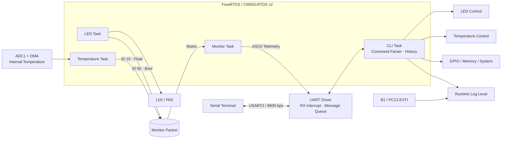
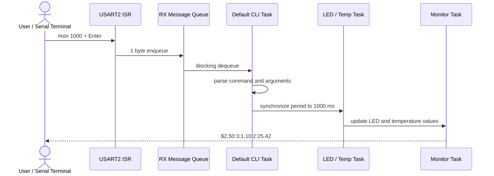

<div align="center">

# ⚙️ STM32F411 FreeRTOS CLI

### UART 명령 제어와 실시간 상태 모니터링을 위한 임베디드 펌웨어

STM32F411에서 FreeRTOS로 LED·온도·모니터링 태스크를 병렬 실행하고,<br>
UART CLI를 통해 하드웨어를 제어하고 상태 데이터를 확인합니다.

</div>

---

## 📌 Project Overview

**STM32F411 FreeRTOS CLI**는 NUCLEO-F411RE 보드에서 동작하는 명령형 펌웨어입니다. USART2로 입력된 명령을 인터럽트와 RTOS 메시지 큐로 수신하고, 동적 명령 등록 구조를 통해 LED, 버튼, GPIO, 메모리, MCU 내부 온도와 시스템 정보를 제어·조회합니다.

LED 토글, 온도 샘플링, 모니터링은 독립된 FreeRTOS 태스크로 분리되어 있습니다. `mon <period>` 명령으로 태스크의 주기를 동기화하면 LED 상태와 온도가 하나의 ASCII 패킷으로 주기적으로 출력됩니다.

| 항목 | 내용 |
| --- | --- |
| 타겟 보드 | NUCLEO-F411RE |
| MCU | STM32F411RET6, Arm Cortex-M4F, 84 MHz |
| 메모리 | 512 KB Flash, 128 KB SRAM |
| RTOS | FreeRTOS + CMSIS-RTOS v2 |
| 사용자 인터페이스 | USART2 기반 Interactive CLI |
| 입·출력 | B1 User Button, LD2 User LED, 동적 GPIO Read/Write |
| 센서 | MCU 내부 온도 센서, ADC1 12-bit, DMA Circular Mode |
| 빌드 시스템 | CMake, Ninja, GNU Arm Embedded Toolchain |
| 주요 언어 | C11, ARM Assembly |

> **CLI 제어, 비동기 UART, RTOS 태스크, ADC DMA, 구조화된 텔레메트리를 하나의 펌웨어에 통합한 프로젝트입니다.**

---

## 📂 Contents

- [🧩 System Architecture](#-system-architecture)
- [✨ Key Features](#-key-features)
- [🧵 FreeRTOS Tasks](#-freertos-tasks)
- [💻 CLI Commands](#-cli-commands)
- [📡 Monitoring Protocol](#-monitoring-protocol)
- [🔌 Hardware Configuration](#-hardware-configuration)
- [🛠️ Tech Stack](#-tech-stack)
- [🚀 Build & Run](#-build--run)
- [📁 Repository Guide](#-repository-guide)
- [💡 Design Notes](#-design-notes)

---

## 🧩 System Architecture



### 동작 흐름



---

## ✨ Key Features

### 1. 확장 가능한 UART CLI

- `cliAdd()`로 응용 명령을 동적 등록하는 구조
- 최대 32개 명령, 명령당 최대 4개 토큰 처리
- 백스페이스, ANSI 위·아래 화살표, 최대 10개 명령 히스토리 지원
- `Ctrl+C`로 주기 작업을 중단하고 LED를 끄는 제어 핸들러

### 2. 비동기 UART 입력과 동기화된 출력

- USART2 RX 인터럽트에서 1 byte를 수신하여 RTOS 메시지 큐에 저장
- CLI 태스크는 큐를 Blocking 방식으로 대기하여 불필요한 Polling 최소화
- UART TX Mutex로 여러 태스크의 로그와 모니터링 패킷 충돌 방지

### 3. ADC + DMA 온도 측정

- ADC1을 12-bit Continuous Conversion으로 설정
- DMA2 Stream 0 Circular Mode로 MCU 내부 온도 센서 값을 계속 갱신
- Floating-point 변환값 출력을 위해 `_printf_float` 링크 옵션 적용

### 4. 주기 동기화 모니터링

- 모니터링 주기 변경 시 LED와 온도 태스크에 Callback으로 전파
- 센서 ID, 데이터 타입, 값으로 구성된 최대 20개 노드 관리
- 공유 패킷을 RTOS Mutex로 보호
- 사람이 읽기 쉽고 PC 프로그램에서 파싱하기 쉬운 ASCII 프로토콜 사용

### 5. 런타임 진단 도구

- ANSI 색상과 Timestamp가 포함된 6단계 로그 레벨
- MCU UID, Device ID, 펌웨어 버전, 빌드 시각, Uptime 조회
- 주소 범위 검증을 거친 Hex/ASCII 메모리 덤프
- GPIOA~GPIOE, GPIOH의 Pin을 실행 중 Input/Output으로 설정하여 읽기·쓰기

---

## 🧵 FreeRTOS Tasks

| 태스크 | 우선순위 | Stack | 주요 역할 |
| --- | --- | ---: | --- |
| `defaultTask` | Normal | 2048 B | 하드웨어·CLI 초기화, UART 명령 수신 및 실행 |
| `myTaskLed` | Low | 1024 B | LD2 주기 토글, LED 상태를 Monitor Packet에 반영 |
| `myTask0Temp` | Low | 2048 B | MCU 내부 온도 주기 샘플링 및 패킷 갱신 |
| `myTaskMonitor` | Low | 2048 B | 설정된 주기로 ASCII 텔레메트리 송신 |

FreeRTOS Tick은 `1 kHz`, Heap은 `heap_4` 기반 `15 KB`로 설정되어 있습니다.

---

## 💻 CLI Commands

시리얼 터미널에서 명령을 입력한 뒤 `Enter`를 누릅니다.

| 명령 | 설명 | 예시 |
| --- | --- | --- |
| `help` | 등록된 CLI 명령 목록 출력 | `help` |
| `cls` | ANSI Escape Sequence로 터미널 화면 지우기 | `cls` |
| `led on\|off` | LD2 켜기 / 끄기 | `led on` |
| `led toggle [period]` | 즉시 토글 또는 ms 단위 자동 토글 | `led toggle 500` |
| `temp` | 현재 MCU 내부 온도 출력 | `temp` |
| `temp <period>` | ms 단위 온도 자동 출력 | `temp 1000` |
| `mon on\|off` | 모니터 패킷 출력 활성화 / 비활성화 | `mon on` |
| `mon <period>` | 모니터, LED, 온도 주기를 동기화하고 시작 | `mon 1000` |
| `button on\|off` | B1 EXTI 이벤트 로그 활성화 / 비활성화 | `button on` |
| `gpio read <pin>` | 지정 GPIO를 Input으로 설정하고 값 읽기 | `gpio read a5` |
| `gpio write <pin> <0\|1>` | 지정 GPIO를 Output으로 설정하고 값 쓰기 | `gpio write b12 1` |
| `md <address> [length]` | 메모리를 Hex + ASCII로 덤프 | `md 08000000 32` |
| `info` | HW 모델, FW 버전, 빌드 시각, UID, Device ID 조회 | `info` |
| `info uptime` | 시스템 가동 시간 조회 | `info uptime` |
| `log get` | 현재 런타임 로그 레벨 조회 | `log get` |
| `log set <0~5>` | `FATAL`부터 `VERBOSE`까지 로그 레벨 설정 | `log set 4` |
| `sys reset` | NVIC System Reset 실행 | `sys reset` |

### 터미널 단축키

| 키 | 동작 |
| --- | --- |
| `↑` / `↓` | 최대 10개의 이전 명령 탐색 |
| `Backspace` | 마지막 문자 삭제 |
| `Ctrl+C` | LED·온도 자동 작업 중단 및 LED Off |

---

## 📡 Monitoring Protocol

모니터링 패킷은 시작 문자 `$`와 종료 문자 `#`으로 구분하며, 각 노드는 `ID:TYPE:VALUE` 형식을 사용합니다.

```text
$<COUNT>,<ID>:<TYPE>:<VALUE>,<ID>:<TYPE>:<VALUE>#\r\n
```

```text
$2,50:3:1,10:2:25.42#
```

| 필드 | 설명 |
| --- | --- |
| `COUNT` | 패킷에 포함된 노드 수 |
| `ID 10` | 온도 값 |
| `ID 50` | LED 상태 |
| `TYPE 0` | `uint8_t` |
| `TYPE 1` | `int32_t` |
| `TYPE 2` | `float` |
| `TYPE 3` | `bool` |

`mon 1000`을 실행하면 LED와 온도 태스크가 1000 ms 주기로 동기화되고, Monitor Task도 같은 주기로 최신 값을 송신합니다.

---

## 🔌 Hardware Configuration

| 기능 | MCU Pin | 설정 |
| --- | --- | --- |
| USART2 TX | PA2 | Alternate Function 7 |
| USART2 RX | PA3 | Alternate Function 7, RX Interrupt |
| LD2 User LED | PA5 | Push-Pull Output, Active High |
| B1 User Button | PC13 | Falling-edge EXTI |
| ADC Temperature | Internal Channel | ADC1, 12-bit, 84 cycles, Continuous + DMA |
| SWDIO | PA13 | Serial Wire Debug |
| SWCLK | PA14 | Serial Wire Debug |

### 시스템 클럭

```text
HSI 16 MHz
  └─ PLL (M=16, N=336, P=4)
      └─ SYSCLK / HCLK : 84 MHz
          ├─ APB1       : 42 MHz
          └─ APB2       : 84 MHz
```

---

## 🛠️ Tech Stack

| 구분 | 기술 |
| --- | --- |
| MCU / Board | STM32F411RET6, NUCLEO-F411RE, Arm Cortex-M4F |
| Firmware | C11, STM32 HAL, CMSIS |
| RTOS | FreeRTOS, CMSIS-RTOS v2, Message Queue, Mutex |
| Peripheral | USART2, GPIO, EXTI, ADC1, DMA2, TIM10 HAL Timebase |
| Build | CMake 3.22+, Ninja, GNU Arm Embedded Toolchain |
| Debug / Flash | ST-LINK, SWD, STM32Cube Programmer |
| Development | STM32CubeMX, STM32Cube for VS Code, clangd |

---

## 🚀 Build & Run

### 1. 준비물

- NUCLEO-F411RE 보드와 USB 케이블
- CMake 3.22 이상
- Ninja
- GNU Arm Embedded Toolchain (`arm-none-eabi-gcc`)
- STM32Cube Programmer 또는 ST-LINK 디버거
- 9600 bps, 8-N-1을 지원하는 시리얼 터미널

### 2. CMake 빌드

```bash
cmake --preset Debug
cmake --build --preset Debug
```

Release 빌드는 다음과 같습니다.

```bash
cmake --preset Release
cmake --build --preset Release
```

빌드가 완료되면 다음 ELF 파일이 생성됩니다.

```text
build/Debug/stm32f_cli.elf
build/Release/stm32f_cli.elf
```

### 3. Flash & Debug

STM32Cube가 구성된 VS Code에서 저장소를 연 뒤, **Run and Debug**의 `STM32Cube: Launch ST-Link GDB Server`를 선택합니다. 설정에 따라 빌드 후 ST-LINK로 펌웨어가 로드됩니다.

STM32Cube Programmer를 사용할 경우 SWD로 보드에 연결한 뒤 생성된 `stm32f_cli.elf`를 선택하여 기록합니다.

### 4. Serial CLI 연결

1. NUCLEO 보드의 ST-LINK Virtual COM Port를 엽니다.
2. 통신 조건을 `9600 baud / 8 data bits / no parity / 1 stop bit / no flow control`로 설정합니다.
3. 터미널에서 `Enter`를 누른 후 `help`를 입력해 명령 목록을 확인합니다.

> CubeMX 생성 코드는 USART2를 115200 bps로 초기화하지만, Application 초기화 과정에서 9600 bps로 재설정합니다. **실제 CLI 접속 속도는 9600 bps입니다.**

---

## 📁 Repository Guide

```text
STM32-main/
├── Core/
│   ├── Inc/                         # CubeMX 생성 헤더, FreeRTOS 설정
│   └── Src/                         # MCU 초기화, ISR, FreeRTOS 태스크 생성
├── MyApp/
│   ├── ap/
│   │   ├── ap.c                    # CLI 명령과 응용 태스크
│   │   └── monitor.c               # 텔레메트리 패킷 관리·전송
│   ├── bsp/                         # HAL Tick 기반 delay / millis 추상화
│   ├── common/                      # 공통 타입, HAL 의존성, 로깅 매크로
│   └── hw/
│       ├── hw.c                    # 하드웨어 드라이버 통합 초기화
│       └── driver/                 # UART, CLI, LED, Button, GPIO, ADC Temp, Log
├── Drivers/                         # STM32 HAL + CMSIS
├── Middlewares/                     # FreeRTOS Kernel + CMSIS-RTOS v2
├── cmake/                          # ARM GCC Toolchain 및 CubeMX CMake 설정
├── CMakeLists.txt                  # 전체 빌드 구성
├── CMakePresets.json               # Debug / Release Ninja Preset
├── stm32f_cli.ioc                  # STM32CubeMX 프로젝트 설정
├── STM32F411XX_FLASH.ld            # 512 KB Flash / 128 KB RAM Linker Script
└── startup_stm32f411xe.s           # Cortex-M4 Startup Code
```

### 레이어 구조

```text
Application  : CLI Command / RTOS Task / Monitor Protocol
Hardware     : UART / LED / Button / GPIO / Temperature / Log
BSP          : Time Abstraction
HAL & RTOS   : STM32 HAL / CMSIS / FreeRTOS
```

---

## 💡 Design Notes

| 주제 | 적용 방식 |
| --- | --- |
| UART 수신 | ISR에서 최소 작업만 수행하고 256-byte RTOS Queue로 CLI 태스크에 전달 |
| 출력 경쟁 | UART TX와 Monitor Packet을 각각 Mutex로 보호 |
| 태스크 결합도 | 모니터 주기 변경을 Callback으로 전파하여 모듈 간 직접 의존 최소화 |
| 로그 비용 | Compile-time 최대 레벨과 Runtime 레벨을 분리해 출력량 조절 |
| 메모리 조회 | Flash, SRAM, System Memory, Peripheral 범위를 검증한 후 byte 단위로 출력 |
| 지연 처리 | 응용 태스크에서 `osDelay()`를 사용해 Scheduler 점유 방지 |

### 사용 시 참고

- 온도 값은 **MCU 내부 온도 센서**의 ADC 환산값이며, 외부 환경의 정밀 온도계 값과는 차이가 있을 수 있습니다.
- `mon off`는 Monitor Packet 출력만 비활성화합니다. LED·온도 주기 작업까지 중단하려면 `Ctrl+C`를 사용하세요.
- `gpio` 명령은 해당 Pin을 실행 중에 재설정합니다. UART, SWD, LED, Button 등 이미 사용 중인 Pin은 피하는 것이 좋습니다.
- 이 저장소의 CubeMX 생성 부분은 STM32Cube FW_F4 `v1.28.3`을 기준으로 합니다.

---

<div align="center">

**명령 입력부터 비동기 제어, 센서 수집, 실시간 모니터링까지 연결한 STM32 FreeRTOS 펌웨어입니다.**

</div>
